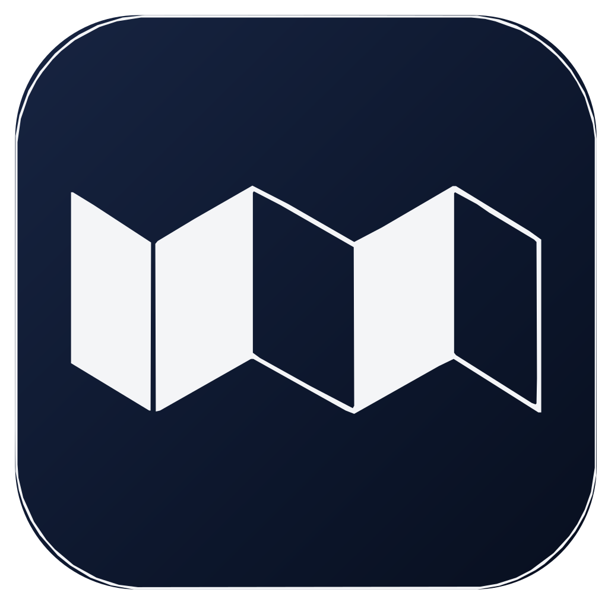

<p align="center">
  
</p>

<h1 align="center"> 长卷｜PSD / PSB 高保真切片导出工具</h1>

<p align="center">
  面向 Windows 的 Photoshop 超长画布切片工具。保持原始宽度与画质，绕过旧导出流程的 8192 像素长边缩小限制。
</p>

## 下载

推荐直接下载已经构建好的 Windows 便携版：

- [下载 WENL 长卷 v0.3.1](https://github.com/WenLiux/wenl-changjuan-psd-slice-exporter/releases/tag/v0.3.1)
- 文件：`WENL-Changjuan-Windows-x64-v0.3.1.zip`

解压后运行 `WENL-Changjuan.exe`。请不要单独移动 EXE，程序必须与 `_internal` 文件夹保持原有相对位置。

## 主要功能

- 读取 PSD 与 PSB 文件中的 Photoshop 切片。
- 按文件原始宽度导出，不再被强制缩小到 419px 等异常尺寸。
- 支持指定输出宽度，并保持全部切片的全局比例与坐标对齐。
- 支持单独选择需要导出的切片。
- 支持 PNG、JPEG、透明背景、JPEG 质量及颜色策略。
- 自动生成不冲突的输出目录，可选 ZIP 压缩。
- 提供导出前检查、进度、取消和导出后验证报告。
- 支持可选的 Photoshop 高保真回退模式。
- 支持文件选择和 PSD / PSB 原生拖拽读取。
- 可在同一文件上重复导出，无需再次解析。

## 使用方法

1. 打开 `WENL-Changjuan.exe`。
2. 将 PSD / PSB 文件拖入窗口，或点击“选择文件”。
3. 选择“原始宽度”或填写指定宽度。
4. 选择切片、文件格式和输出目录。
5. 点击“开始导出”。
6. 完成后可直接打开输出目录或查看验证报告。

## 文件与安全

- 文件仅在本机处理，不会上传到网络。
- 原始 PSD / PSB 以只读方式使用。
- 默认优先读取文件内嵌的合成图，不会自动启动 Photoshop。
- Photoshop 回退只会处理经过验证的系统临时副本，不覆盖原文件。
- 程序不会退出 Photoshop，也不会保存或关闭用户已经打开的文档。
- 深色客户端始终使用明确着色的浅色品牌标识，不会出现黑色 Logo 与深色背景冲突。

## Photoshop 高保真回退

大多数文件无需 Photoshop 即可导出。如果内嵌合成图缺失或不满足安全条件，可在导出设置中启用 Photoshop 回退。

使用回退前请保存并关闭 Photoshop 中已经打开的文档。是否允许启动 Photoshop 属于单次授权，不会被永久保存。

## 命令行使用

保留原始尺寸：

```powershell
python scripts/export_original_size.py input.psd
python scripts/export_original_size.py input.psb --output-parent D:\Exports --zip
```

指定输出宽度：

```powershell
python scripts/export_slices.py input.psb --width 750
python scripts/export_slices.py input.psd --width 1440 --no-upscale
```

不填写 `--width` 时保留原始尺寸。

PNG 与 JPEG：

```powershell
python scripts/export_slices.py input.psd --width 1440 --format png
python scripts/export_slices.py input.psd --width 1440 --format jpeg
python scripts/export_slices.py input.psd --format jpeg `
  --jpeg-quality 100 --background "#F5F5F5" --color srgb
```

## 从源码运行

安装 Python 依赖：

```powershell
python -m pip install -r requirements.txt
```

构建 React 界面并启动桌面客户端：

```powershell
cd frontend
npm.cmd install
npm.cmd run build
cd ..
python -m app.main
```

界面使用本地打包资源，正式客户端运行时不需要开发服务器或互联网连接。

## 构建 Windows 版本

```powershell
python -m venv .venv-release
.\.venv-release\Scripts\python.exe -m pip install -r requirements-build.txt
powershell.exe -NoProfile -ExecutionPolicy Bypass `
  -File .\scripts\build_windows.ps1
```

构建结果：

```text
dist\WENL-Changjuan\WENL-Changjuan.exe
```

## 设置目录

WENL 长卷品牌版使用：

```text
%APPDATA%\WENL\Changjuan\settings.json
```

首次启动时，如果新目录没有设置文件，程序会读取并复制旧版设置，旧文件不会被删除。

## 当前版本

当前稳定版本：`v0.3.1`

本版本包含 WENL 长卷品牌化 WebView2 客户端、React/TypeScript 界面、原生拖拽修复、宽度切换逻辑修复和 Windows 多尺寸程序图标。

当前自动测试结果：

```text
139 passed, 11 skipped
```

详细发布内容请查看：[v0.3.1 发布说明](docs/v0.3.1-release.md)。

## 许可证与公开仓库

本仓库公开前已完成本地路径、测试素材和个人信息审计。源代码现采用
[PolyForm Noncommercial License 1.0.0](LICENSE)：允许非商业目的的使用、研究、修改和
再分发，但商业使用需要事先取得书面授权。WENL / 长卷名称、Logo、图标和品牌视觉
资产不包含在源代码许可证授权内，详见 [NOTICE](NOTICE) 与
[品牌资产说明](docs/legal/trademarks.md)。

## 项目文档

- [文档导航](docs/README.md)
- [GitHub 发布清单](docs/GITHUB-PUBLISH.md)
- [贡献指南](CONTRIBUTING.md)
- [安全问题报告](SECURITY.md)
- [许可证](LICENSE) · [NOTICE](NOTICE)
- [商业使用说明](docs/legal/commercial-use.md)
- [第三方依赖声明](docs/legal/third-party-notices.md)
- [最终验收报告](docs/stage-10-acceptance.md)
- [Windows 构建报告](docs/stage-9-report.md)
- [Web UI 重构报告](docs/ui-redesign-report.md)
- [初始实现审计](docs/stage-0-audit.md)

## 旧版命令行导出器

经过审查的旧版独立实现保留在：

```text
legacy/export_psd_slices_1440.py
```

运行方式：

```powershell
python legacy/export_psd_slices_1440.py input.psd output-folder
```
