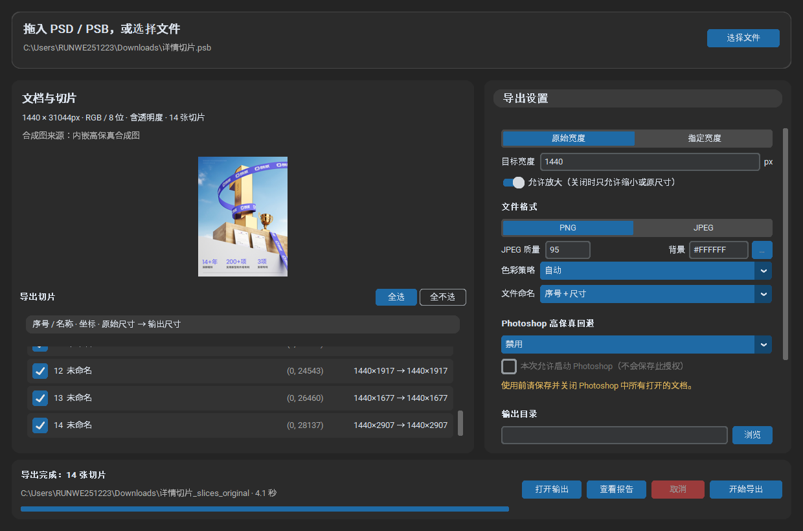
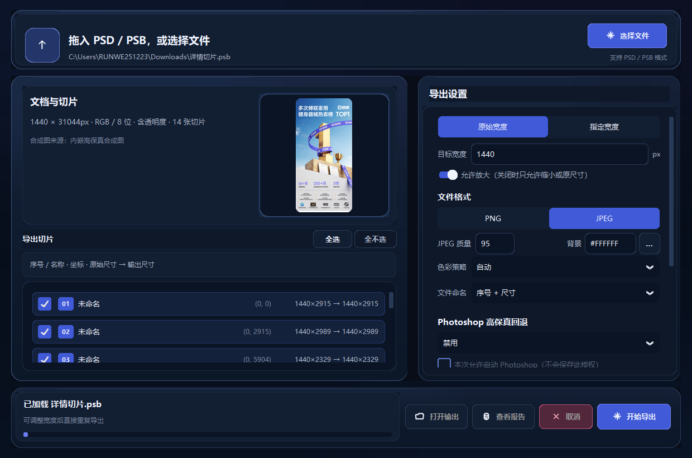
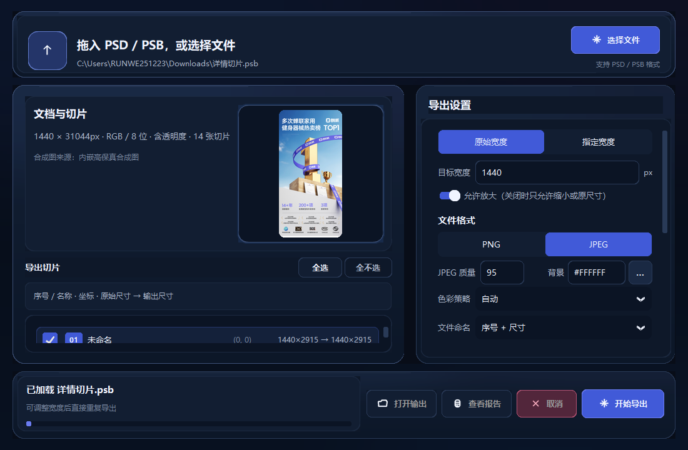

# PSD/PSB 切片工具 0.2.0 UI 视觉重构报告

## 结论

0.2.0 已完成视觉重构、功能回归、真实文件测试、Windows 重新打包及解压后
验证。切片解析、缩放、导出、Photoshop 回退、设置保存和后台任务逻辑均未
改变。

正式 Windows 成品：

```text
release\PSD-PSB-Slice-Exporter-Windows-x64-v0.2.0.zip
```

## 第一阶段分析结果

- UI 技术栈：CustomTkinter 6.0.0、Tkinter、tkinterdnd2、Pillow。
- 主窗口入口：`app/main.py` → `app/ui/main_window.py`。
- 原版本没有独立主题文件，颜色和组件参数直接写在主窗口中。
- 主要组件：文件拖放区、文档信息、首张切片预览、切片滚动列表、导出设置
  滚动区、底部状态和四个操作按钮。
- 可复用逻辑：表单变量、模式切换、后台 TaskRunner、导出进度、缓存会话和
  安全关闭；这些逻辑全部保留。

## 新主题与公共组件

新增 `app/ui/theme.py`，统一管理：

```text
bg_window / bg_card / bg_card_secondary / bg_input
border_default / border_subtle / border_emphasis / border_highlight
text_primary / text_secondary / text_muted / text_disabled
accent_primary / accent_secondary / danger / warning
radius_small / radius_medium / radius_large
spacing_small / spacing_medium / spacing_large
shadow_card / shadow_accent / preview_glow
```

新增 `app/ui/components.py`，提供：

- `GlassCard`：静态渐变、圆角遮罩、低透明度局部漫反射和细内高光；
- primary / secondary / danger / quiet 四级按钮；
- 统一的输入框、下拉框、复选框、开关和分段按钮；
- 上传、文件夹、报告、关闭、开始导出的统一线性图标；
- 低对比窗口环境渐变。

卡片渐变只在创建时和窗口缩放停止 70ms 后重绘，没有循环动画或高频刷新。

## 视觉变化

旧版：



0.2.0 标准窗口：



0.2.0 最小窗口：



主要变化：

- 纯灰黑背景改为低对比深蓝环境渐变；
- 四个主区域改为外层渐变卡面加暗色内层内容面的双层结构；
- 强亮蓝描边收敛为蓝灰边框、细顶部高光和局部漫反射；
- 预览图增加圆角蒙版、窄范围蓝灰柔光和更稳定的显示尺寸；
- 下拉框和输入框默认保持暗色，只在选中控件和主按钮上使用蓝紫强调；
- 切片行增加统一圆角、序号徽标、低对比坐标和尺寸信息；
- 按钮统一为 primary、secondary、danger 和 quiet 四个等级；
- 底部状态区使用独立内层卡面，开始导出仍是最强视觉焦点；
- 没有使用参考图作背景，所有元素仍是真实可交互控件。

## 响应与 DPI

已实拍检查：

```text
推荐窗口：1240 × 820
最小窗口：1100 × 720
```

最小窗口下：

- 底部四个按钮没有重叠；
- 左右栏比例保持稳定；
- 切片列表和导出设置保留独立滚动；
- 主信息、尺寸和按钮文字未被遮挡。

另外分别以 125% 和 150% CustomTkinter 缩放创建 1100 × 720 窗口，设置栏、
底部操作区和安全关闭均正常。

## 功能和发布验证

完整源代码测试：

```text
140 passed in 76.78s
```

该结果同时启用了：

- V8 PSD 真实样本；
- V6 PSB 真实样本；
- 真实 Windows GUI 加载和 750px 导出测试。

0.2.0 最终 EXE 验证：

| 输入 | 目标宽度 | 切片 | 验证 | 源文件不变 |
| --- | ---: | ---: | --- | --- |
| 565656未标题-1.psd | 1440 | 14 | 通过 | 是 |
| 详情切片.psb | 750 | 14 | 通过 | 是 |

最终 EXE 已确认：

- FileVersion 和 ProductVersion 均为 0.2.0；
- tkinterdnd2 2.10.1 可在冻结环境加载；
- GUI 窗口正常响应并可安全关闭；
- 从最终 ZIP 解压后再次按 1440px 导出 PSB，14 张切片验证通过。

发布包：

```text
文件数：1,193
解压大小：87,210,341 bytes
ZIP 大小：36,318,314 bytes
```

SHA-256：

```text
ZIP
9A2F696318482827927BA0C5DE97DAA0092CE2C989A2DC070804BAD078BB115A

EXE
3A797333A0D661B2FE021502263A591B59BBBA8304B13EA592CE3F55E9860C6D
```

## 修改文件

- `app/main.py`
- `app/ui/main_window.py`
- `app/ui/theme.py`
- `app/ui/components.py`
- `tests/test_ui_theme.py`
- `pyproject.toml`
- `packaging/version_info.txt`
- `packaging/README-CN.txt`
- `README.md`
- `docs/HANDOFF-CN.md`
- `docs/ui-visual-rebuild-spec.md`
- `docs/ui-reference/*`
- `docs/ui-redesign-report.md`

## 仍需注意

- Tk/CustomTkinter 没有浏览器式的逐卡片 backdrop blur。本版本使用静态渐变、
  圆角遮罩、明暗分层和局部柔光模拟玻璃质感，避免引入高频重绘或新 UI
  框架。
- Windows 成品仍未数字签名，首次运行可能出现 SmartScreen 提示。
- Windows Computer Use 截图接口在本机返回系统错误 `0x80004002`；视觉验收
  改用只读窗口捕获完成，没有进行盲目点击。
